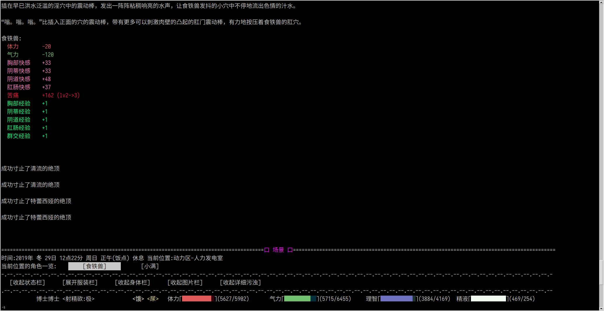
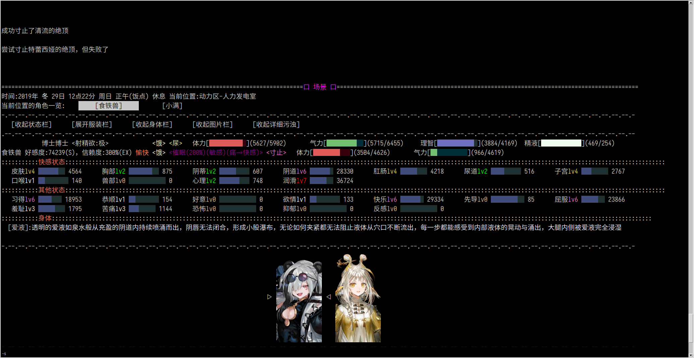

# PR Readiness Record

## Status

As of 2026-07-13, the candidate code and PR package are ready for local human review. Upstream submission is intentionally waiting on several days of player testing.

- Candidate worktree: `/home/ubuntu/games/erArk-pr-edge-shared-settlement`
- Candidate branch: `codex/fix-edge-settlement-shared-decision`
- Candidate commit: `579b7c47504038b6523decf71a565029ba76860a`
- Candidate base: `0268fe5719749b984a4a4b1ff69a94b42661f7ca` (`upstream/master` at the final rebase)
- Fork branch: `pr-fork/codex/fix-edge-settlement-shared-decision` on `https://github.com/meower-z/erArk-fork`
- Publication state: `local-review-ready`
- Upstream PR state: not created or updated by this work; image evidence has not been uploaded
- Current gate: user playtesting through the enabled local mod before deciding whether to submit upstream
- Local playtest state: development `main` commit `fe3b67b318c9c46761cbb2778d1c7f76a65b2fa3`, pushed to `origin/main`

Local development `main` uses `local_orgasm_settle_edge_fix` to exercise the same player-visible settlement rule. The older player-action-window implementation `local_h_orgasm_batch_fix` and its dependent `local_group_edge_release_fix` are retained but disabled. The local test mod is not part of the upstream diff.

## Submitted Diff

- Production file: `Script/Design/second_behavior.py`
- Production delta: 40 insertions, 17 deletions
- Submitted test: `tests/test_orgasm_edge_settlement.py`, 295 lines
- Exact diff, gzip-compressed without timestamps: [evidence/proposed.diff.gz](evidence/proposed.diff.gz)
- Uncompressed diff SHA-256: `8781d9b9861330dc1ebc357573bd560b1980b46f938ea8b142671f57438d374b`
- Compressed artifact SHA-256: `a0bc051f4100fd3e21944518449ba1aaba94ba19b240e8f615ad5f3ed4b5a807`

The implementation collects the complete supported count snapshot before mutation, makes one edge decision for one `orgasm_settle()` invocation, applies one shared branch, and removes the caller replay that previously advanced already-processed levels twice.

## Automated Evidence

- `python -m pytest -q tests/test_orgasm_edge_settlement.py`: 11 passed
- `python -m py_compile Script/Design/second_behavior.py tests/test_orgasm_edge_settlement.py`: passed
- `git diff --check`: passed
- Focused coverage includes complete-snapshot success, compound shared failure without replay, the real `orgasm_judge()` input chain, time-stop/non-edge/explicit-release inverse paths, judge exceptions, unsupported keys, and two independent settlement calls.
- Fable code-quality audit: correctness and tests passed; its three comment-precision findings were applied. Durable copy: [evidence/fable-code-quality-audit.md](evidence/fable-code-quality-audit.md).
- Fresh artifact audit: `PASS`, `publication_state: local-review-ready`. Durable copy: [evidence/artifact-audit-pass.md](evidence/artifact-audit-pass.md).

## Real Tk Evidence

The final A/B used real Tk under the same allocator-owned Xvfb display, a 2070x1070 captured window, save slot 99, `PYTHONHASHSEED=0`, `ERARK_EVIDENCE_SEED=0`, and the same route: load the save, execute exactly six `[6001]` waits with matching discovery choices, then scroll to the edge-result cluster.

Baseline:

- The inspected history contains two `成功寸止了清流的绝顶` lines and two `成功寸止了特蕾西娅的绝顶` lines.
- SHA-256: `e558845f4f67d0781fb92ae9032edbceda0bfb510246b027c4d447d95fe97aae`

Candidate:

- The inspected history contains one `成功寸止了清流的绝顶` line and one `尝试寸止特蕾西娅的绝顶，但失败了` line.
- SHA-256: `1010d6bdae2a281f657da53c96856905e6cb96622f54b6eb8eb04d11be8ad6c1`

Provenance:

- [evidence/setup-equivalence.txt](evidence/setup-equivalence.txt)
- [evidence/baseline-action-log.txt](evidence/baseline-action-log.txt)
- [evidence/candidate-action-log.txt](evidence/candidate-action-log.txt)

The images have not been published. The PR draft therefore intentionally retains `[BEFORE_IMAGE_URL]` and `[AFTER_IMAGE_URL]` placeholders.

## Final PR Text

The following is the exact Fable-written draft (`claude-fable-5`, effort `medium`) preserved for later publication. A standalone byte-identical copy is [evidence/pr-draft.md](evidence/pr-draft.md). SHA-256: `a74efb7f36820d53cb2e8761525b54844bfc31574275b451c9d347c04fa76340`.

---

# 修复寸止结果在一次高潮结算中重复显示、高潮等级重复推进

## 问题

开启绝顶寸止后，当一名角色在同一次高潮结算中有多个部位同时达到高潮时，界面会为同一角色连续显示多次寸止结果（例如连续两条“成功寸止了清流的绝顶”）。更严重的是，如果前一个部位寸止成功、后一个部位寸止失败，整批高潮会被重新结算一遍，导致已经结算过的部位高潮等级被重复推进，数值凭空变多。

原因在 `orgasm_settle`：函数在遍历各个高潮部位时逐个进行寸止判定，每个部位各自输出一次结果；一旦中途某个部位判定失败，旧调用方会把这批高潮整体重跑一次结算，之前已提交的等级变化就被叠加了。

## 修复

在修改任何部位状态之前，先收集本次结算涉及的全部高潮部位计数，只做一次寸止判定，然后所有部位共同走成功或失败分支：

- 共同成功：各部位照常计入寸止计数，只显示一次成功。
- 共同失败：把此前累积的寸止旧账与本次高潮一起解放，正常结算并只显示一次失败；高潮等级只推进一次，不再重跑。

时停累积、主动解放、非寸止路径不进入这次共同判定，保持原有逻辑不变。

## 验证

游戏内路线：开启绝顶寸止并带多名角色进入群交，载入同一存档后连续六次执行「等待五分钟」并逐页查看结算记录。

修复前，清流与特蕾西娅各自连续显示两次寸止结果：

修复后，同一次结算中每名角色只显示一个共同结果（清流一次成功，特蕾西娅一次失败）：

自动化验证：

- `python -m pytest -q tests/test_orgasm_edge_settlement.py` — 11 passed。新增回归测试覆盖：共同成功前使用完整计数快照、共同失败只解放和推进等级一次、真实输入链只触发一次结算、时停/非寸止/主动解放等路径不受影响、两次独立结算仍各自判定。
- `python -m py_compile Script/Design/second_behavior.py tests/test_orgasm_edge_settlement.py` — 通过。

---

## Publication Checklist

- [x] Candidate code and submitted tests ready
- [x] Fable PR text ready
- [x] Deterministic Tk evidence ready and inspected
- [x] Fresh artifact audit passed
- [ ] User playtest decision recorded
- [ ] Evidence images uploaded with user authorization
- [ ] Image placeholders replaced with final URLs
- [ ] Upstream PR created or updated with user authorization
